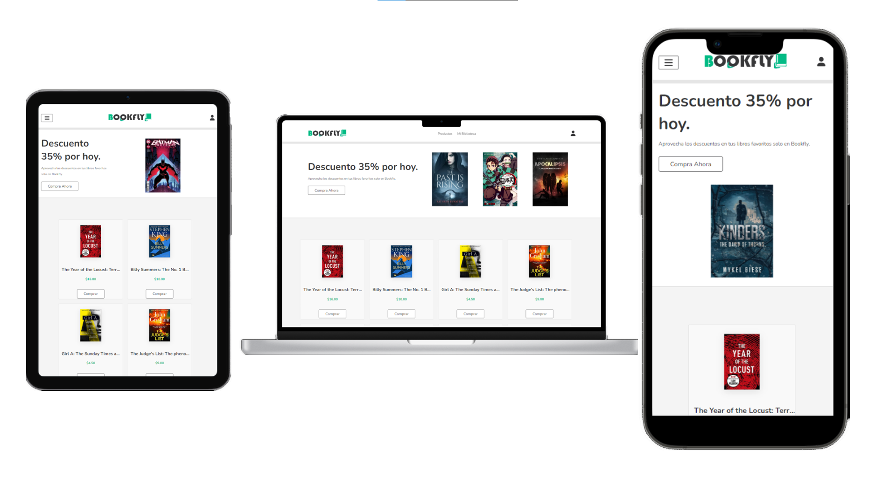
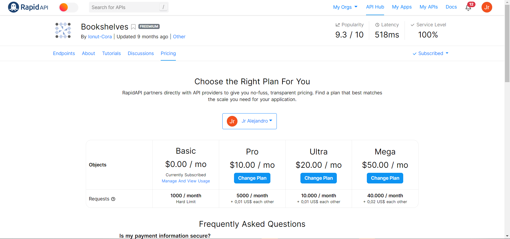

# Practicas-Junior-C
BOOKFLY  es un lugar donde puedes encontrar tu libro favorito 
# Practicas Junior Calva.
# Proyecto CONSUMO A UNA API => PAGE.
#### Control de practicas preprofesionales

| Actidad | Tipo | Semana | Contenido | Estado |
| --- | --- | --- | --- | --- |
| Investigación | Ins | semana 1 | API | Completo |
| Maquetado | Prac | semana 2 | HTML | Completo |
| Diseño | Prac | semana 3 | CSS | Completo |
| Diseño | Prac | semana 4 | CSS, Responsive | Completo |
| Analisis API | Prac | semana 5 | JavaScript | Completo |
| Consumo API | Prac | semana 6 | JavaScript | Completo |
| Estructura API | Prac | semana 7 | JavaScript | Completo |
| Despleguie de Aplicacion | Prac | semana 8 | GitHub | Completo |
#### Investigación
#### **¿Qué es una API?**

#### El término API es una abreviatura de Application Programming Interfaces, que en español significa interfaz de programación de aplicaciones. Se trata de un conjunto de definiciones y protocolos que se utiliza para desarrollar e integrar el software de las aplicaciones, permitiendo la comunicación entre dos aplicaciones de software a través de un conjunto de reglas.

#### **Codigos de estado HTTP.**
#### Errores Cliente.
#### *400 Bad Request*
#### Esta respuesta significa que el servidor no pudo interpretar la solicitud dada una sintaxis inválida.
#### *401 Unauthorized*
#### Es necesario autenticar para obtener la respuesta solicitada. Esta es similar a 403, pero en este caso, la autenticación es posible.
#### *402 Payment Required*
#### Este código de respuesta está reservado para futuros usos. El objetivo inicial de crear este código fue para ser utilizado en sistemas digitales de pagos. Sin embargo, no está siendo usado actualmente.
#### *403 Forbidden*
#### El cliente no posee los permisos necesarios para cierto contenido, por lo que el servidor está rechazando otorgar una respuesta apropiada.
#### *404 Not Found*
#### El servidor no pudo encontrar el contenido solicitado. Este código de respuesta es uno de los más famosos dada su alta ocurrencia en la web.
#### *405 Method Not Allowed (en-US)*
#### El método solicitado es conocido por el servidor pero ha sido deshabilitado y no puede ser utilizado. Los dos métodos obligatorios, GET y HEAD, nunca deben ser deshabilitados y no deberían retornar este código de error.
#### **Métodos GET & POST.**
#### Método GET.
> #### GET lleva los datos de forma "visible" al cliente (navegador web). El medio de envío es la URL. Los datos los puede ver cualquiera.

#### Método POST.

> #### POST consiste en datos "ocultos" (porque el cliente no los ve) enviados por un formulario cuyo método de envío es post. Es adecuado para formularios. Los datos no son visibles.
|  | GET| POST |
| :---         |     :---:      |          ---: |
| **Visibilidad**		  | Visible en la barra de direcciones para el usuario   | Invisible para el usuario  |
| **Caché y registro del servidor**     |Los parámetros URL se guardan sin cifrar.       | Los parámetros URL no se guardan automáticamente    |
| **Tipo de datos**     | Solo caracteres ASCII      | Caracteres ASCII y datos binarios     |
| **Longitud de datos**    | Limitado al máximo del URL (2048 caracteres)       | Ilimitado    |
#### **¿Qué  es Node.js?**
.

#### **NodeJs** es un entorno de ejecución de JavaScript back-end, multiplataforma y de código abierto que corre en el motor V8 y ejecuta código JavaScript fuera de un navegador web.

 

#### Se utiliza en la mayoría de los casos para construir servicios BackEnd, o mejor conocidos como API (Application Programming Interfaces), estos son los servicios que le dan poder a aplicaciones web ejecutándose dentro de un navegador o a una aplicación móvil ejecutándose dentro de un dispositivo móvil.

### *¿Qué se utlizo en este proyecto?*
#### Se uso Html, Css y JavaScript y la Api es Bookshelves que la puedes encontrar en la plataforma de Rapiapi.
###
.

### Para los estilos Css utlizamos Flexbox que es  es un módulo de diseño de CSS3 que se creó para mejorar la forma en la que se hace diseño responsive y nos facilita para la Adaptacion a cada dispositivo.


###  Además el metodo que se utilizo para llamar la Api fue el **fetch** mas el **Async y Await** para manejar el Asincronismo de nuestra Api

.

### Aqui nuestro código para llamar a la Api
### Y utilizamos el  método Get para trear la portada, titulo y precio.
```javascript
const API = 'https://bookshelves.p.rapidapi.com/books';
 const options = {
     method: 'GET',
     headers: {
         'X-RapidAPI-Key': 'dd0d3acf93msh61d4ac9c49b4beap104636jsn76d9475905db',
         'X-RapidAPI-Host': 'bookshelves.p.rapidapi.com'
     }
 };
 // Call to API to Json to Data 
 const fetchData = async(urlApi) => {
     const response =await fetch (urlApi,options);
     const data = await response.json();
     return data;
 }


//Funtion map to Books
 (async function getBooksMain ()  {
     const getBooks =await fetchData(API);
     const content = document.getElementById('content');
     let view = `
     ${getBooks.Books.map((j) => `
     
    
        <div class="box" >
            <div class="icons">
                 <a href="#" class="fas fa-eye"></a>
            </div>
                
                    <div class="content">
                         <h3>${j.title}</h3> 
                         <div class="price"> <span>${j.price.replace(/\u00A3/g, '$')}</span></div>
                         
                    </div>
             <a href="
             " class="btn">Comprar </a>
        </div>
       
         `
     ).splice(0,36).join('')}`;
     content.innerHTML = view;
 })(); 
 
getBooksMain()
```
### Además debido aque la api nos traía el libras esterlinas utlizamos el replace y lo volvimos a dólares.
### Este sería el Proyecto Bookflix se vendrán nuevas mejoras en cada versión implementando nuevas herramientas.
